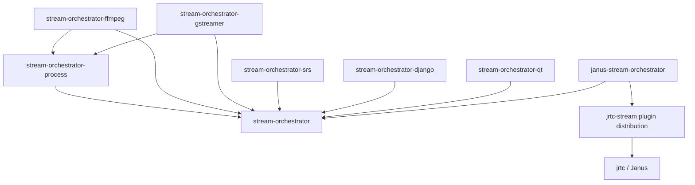

# Architecture

## Primary decision

The orchestration system is not part of the Janus client. The packages meet at
an optional bridge selected by the host application.

`jrtc` is deliberately unaware of named plugins. The Streaming
distribution owns `StreamingPlugin`, publishes it under the
`jrtc.plugins` entry-point group, and owns every Streaming request,
response, and convenience helper.
Its administration and viewer APIs remain composition layers around that
concrete handle, so no unstable core transport models escape into public domain
objects.

## Stable concepts

`StreamDefinition` is desired configuration. `StreamStatus` is observed and
reconciled state. `MountpointRef` identifies one concrete mountpoint generation.
`SourceRuntimeRef` identifies one producer instance. They must never be treated
as the same resource.

The core owns only protocols and orchestration rules:

- `MountpointBackend`
- `SourceDriver`
- `SourceGate`
- `StreamRepository`
- `LockManager`
- `EventPublisher`
- `Clock`

## Generation invariant

A managed producer sends to the ports of exactly one mountpoint generation. If
that mountpoint disappears or a media contract changes, the producer must be
stopped and prepared against the replacement targets. Reusing the old process
reference is unsafe.

## State dimensions

A stream has independent desired, mountpoint, producer, media, and aggregate
operational states. A running process does not imply flowing media. Janus packet
freshness is the authoritative final readiness signal for Janus-backed streams.

## Source gates

A source gate delays process startup until an external prerequisite exists. The
SRS package provides a publisher gate. A gate does not replace reconciliation:
callbacks may wake the controller, but periodic observation establishes truth.

## Integration boundary

Django stores records and events but does not choose a media backend. Qt runs
an application-composed service but does not import Janus. The host application
is the composition root and may use local processes, containers, Kubernetes, a
remote media agent, or another implementation of the same ports.
